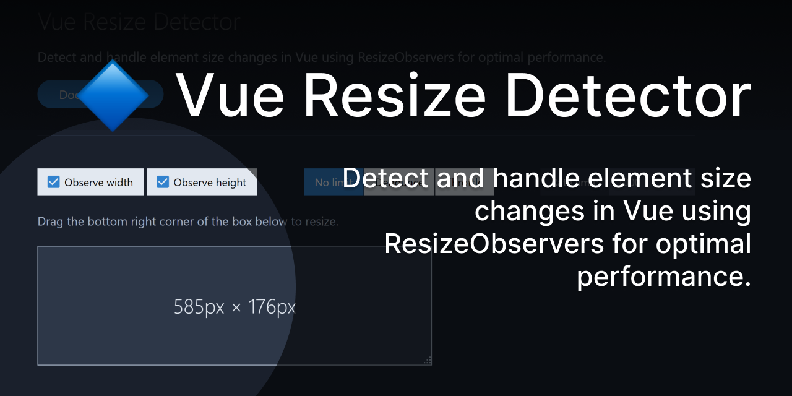

# Vue Resize Detector

🔷 Detect and handle element size changes in Vue using [ResizeObservers](https://wicg.github.io/ResizeObserver/) for optimal performance.

[](https://vue-resize-detector.netlify.com)

Vue Resize Detector is based on the excellent [React Resize Detector](https://github.com/maslianok/react-resize-detector/), and uses the [ResizeObserver](https://wicg.github.io/ResizeObserver/) API (automatically polyfilled) to detect when a target element's size changes.

This project is part of [#CreateWeekly](https://dev.to/josephuspaye/createweekly-create-something-new-publicly-every-week-in-2020-1nh9), my attempt to create something new publicly every week in 2020.

## Demo

<https://vue-resize-detector.netlify.com>

## Installation

```
npm install vue-resize-detector
```

## Usage

### Use with an event

You can listen for the `resize` event to access the changing width and height:

```vue
<template>
  <div>
    <ResizeDetector observe-width observe-height @resize="onResize" />
    <p>{{ width }} x {{ height }}</p>
  </div>
</template>

<script>
import ResizeDetector from 'vue-resize-detector';

export default {
  components: { ResizeDetector },
  data() {
    return {
      width: 0,
      height: 0,
    };
  },
  methods: {
    onResize(width, height) {
      this.width = width;
      this.height = height;
    },
  },
};
</script>
```

### Use with a scoped slot

You can use a [scoped slot](https://vuejs.org/v2/guide/components-slots.html#Scoped-Slots) to access the changing width and height:

```vue
<template>
  <div>
    <ResizeDetector observe-width observe-height v-slot="{ width, height }">
      <p>{{ width }} x {{ height }}</p>
    </ResizeDetector>
  </div>
</template>

<script>
import ResizeDetector from 'vue-resize-detector';

export default {
  components: { ResizeDetector },
};
</script>
```

### Use a CSS selector for the target

You can change the element that is watched for size changes by setting the `target` prop to a CSS selector matching your desired element:

```vue
<template>
  <div>
    <div id="my-target">Target element</div>
    <ResizeDetector target="#my-target" observe-width observe-height />
    <p>{{ width }} x {{ height }}</p>
  </div>
</template>

<script>
import ResizeDetector from 'vue-resize-detector';

export default {
  components: { ResizeDetector },
  data() {
    return {
      width: 0,
      height: 0,
    };
  },
  methods: {
    onResize(width, height) {
      this.width = width;
      this.height = height;
    },
  },
};
</script>
```

### Debounce size change updates

You can debounce the rate at which size changes are emitted by setting the `rateLimiter` prop to `"debounce"` and setting the `rateLimit` prop to your desired wait time.

```vue
<template>
  <div>
    <ResizeDetector
      observe-width
      observe-height
      rate-limiter="debounce"
      :rate-limit="500"
      @resize="onResize"
    />
    <p>{{ width }} x {{ height }}</p>
  </div>
</template>

<script>
import ResizeDetector from 'vue-resize-detector';

export default {
  components: { ResizeDetector },
  data() {
    return {
      width: 0,
      height: 0,
    };
  },
  methods: {
    onResize(width, height) {
      this.width = width;
      this.height = height;
    },
  },
};
</script>
```

### Throttle size change updates

You can throttle the rate at which size changes are emitted by setting the `rateLimiter` prop to `"throttle"` and setting the `rateLimit` prop to your desired wait time.

```vue
<template>
  <div>
    <ResizeDetector
      observe-width
      observe-height
      rate-limiter="throttle"
      :rate-limit="500"
      @resize="onResize"
    />
    <p>{{ width }} x {{ height }}</p>
  </div>
</template>

<script>
import ResizeDetector from 'vue-resize-detector';

export default {
  components: { ResizeDetector },
  data() {
    return {
      width: 0,
      height: 0,
    };
  },
  methods: {
    onResize(width, height) {
      this.width = width;
      this.height = height;
    },
  },
};
</script>
```

## API

### Props

| Prop               | Type                                                                              | Default     | Description                                                                                                                                                                                                                                                               |
| ------------------ | --------------------------------------------------------------------------------- | ----------- | ------------------------------------------------------------------------------------------------------------------------------------------------------------------------------------------------------------------------------------------------------------------------- |
| `target`           | [DOM Element](https://developer.mozilla.org/en-US/docs/Web/API/Element) or String | `undefined` | The target element or CSS selector string of the target element to watch for size changes. If not set, the component's immediate parent in the DOM will be used as the target.                                                                                            |
| `observeWidth`     | Boolean                                                                           | `false`     | When `true`, the component observes changes to the target element's width, and emits the `resize` event when the width changes.                                                                                                                                           |
| `observeHeight`    | Boolean                                                                           | `false`     | When `true`, the component observes changes to the target element's height, and emits the `resize` event when the height changes.                                                                                                                                         |
| `skipOnMount`      | Boolean                                                                           | `false`     | When `true`, the component skips emitting the `resize` event when it is mounted.                                                                                                                                                                                          |
| `rateLimiter`      | String                                                                            | `undefined` | The function to use for limiting the rate at which size change events are emitted. One of [`"debounce"`](https://lodash.com/docs#debounce) or [`"throttle"`](https://lodash.com/docs#throttle). When `undefined`, the `resize` event is emitted on every animation frame. |
| `rateLimit`        | Number                                                                            | `1000`      | The rate limit wait time, in milliseconds. Used together with the `rateLimiter` prop. This value is passed to the [`debounce`](https://lodash.com/docs#debounce) or [`throttle`](https://lodash.com/docs#throttle) function as the `wait` parameter.                      |
| `rateLimitOptions` | Object                                                                            | `undefined` | Additional options to pass to the [`debounce`](https://lodash.com/docs#debounce) or [`throttle`](https://lodash.com/docs#throttle) function, in the shape of `{ leading: bool, trailing: bool }`. Used together with the `rateLimiter` prop.                              |

### Events

| Event    | Description                                                                                                     |
| -------- | --------------------------------------------------------------------------------------------------------------- |
| `resize` | Emitted when the target element size changes. The handler is called with the new width and height as arguments. |

### Slots

| Slot      | Description                                                                                                             |
| --------- | ----------------------------------------------------------------------------------------------------------------------- |
| (default) | The default slot. Can hold any content with a single root element, and is passed the `width` and `height` as arguments. |

## Contributing

See [contribution guide](CONTRIBUTING.md).

## Licence

[MIT](LICENCE)
